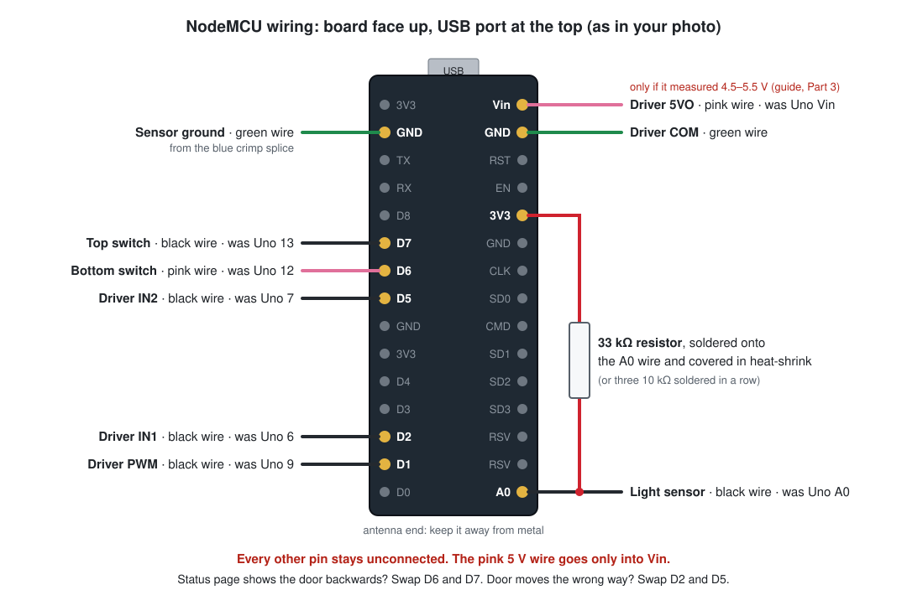

# Stage 2: moving the original door from the Uno to WiFi

This guide moves the original (one light sensor) coop door from the Arduino Uno to the HiLetgo NodeMCU (ESP8266) board. You get a status page, Open/Close buttons on your phone, and notifications.

**Do stage 1 first.** That's the `OriginalDoor_Stage1` sketch on the Uno. Run it until you're happy with its light levels.

**What changes:** the Uno comes out and the NodeMCU goes in its place. You move 9 wires and add 1 resistor.

**What stays:** the red XY-15AS motor driver, the motor, the power supply, both magnetic switches and the light sensor.

**Time:** about 1–2 hours, plus a few evenings of checking that the door closes at dusk.

**When to do it:**
- Do Parts 4–6 during the day, after the door has opened in the morning and the chickens are out.
- If Part 6 isn't finished by about 2 hours before sunset, put the Uno back for the night ([Going back to the Uno](#going-back-to-the-uno)) and try again another day. The Uno keeps its program, so going back takes about 10 minutes.



## The parts, as they appear in your photos

| Part | What it is | What happens to it |
|---|---|---|
| Blue Arduino Uno | Runs the door today | Comes out. Keep it as a spare. |
| Red board marked **XY-15AS** | Motor driver. Its orange plug is labeled **5VO, PWM, IN1, IN2, COM**. | Stays. Its wires stay screwed into the orange plug. |
| Black HiLetgo board with **ESP8266MOD** | The new controller. Its pins are labeled D0–D8, A0, 3V3, GND and Vin. | Goes in where the Uno was. |

The driver's orange plug is what the Uno talks to:

| Driver pin | What it does |
|---|---|
| **5VO** | A 5 V output from the driver that powers the controller |
| **COM** | Ground |
| **PWM** | Motor speed |
| **IN1 / IN2** | Direction: IN1 on = door goes up, IN2 on = door goes down |

## Part 1: What you need

**You already have:** the NodeMCU, a multimeter, a small screwdriver, wire cutters and strippers, a soldering iron, heat-shrink, masking tape and a marker, and your laptop.

**Get these if you don't have them:**

- **A micro-USB cable that carries data.** The Uno's blue cable doesn't fit this board. Many phone cables are charge-only, and Windows won't see the board through them.
- **One 33 kΩ resistor.**
  - Color bands: orange, orange, orange on a 4-band resistor, or orange, orange, black, red on a 5-band one.
  - Check it with the multimeter on ohms. It should read 32–34 kΩ.
  - If you only have 10 kΩ resistors, solder three of them end to end (don't just twist them) to make about 30 kΩ. That works too.
- **About 10 cm of solid-core hookup wire** (22 AWG). Any spare jumper or hookup wire with a solid core works.
- **A half-size solderless breadboard** (the 400-hole kind). It's the easiest way to connect your existing bare wire ends to the NodeMCU, and it's easy to undo.
- **A 5 V USB phone charger or a power bank.** You need one for the WiFi check in Part 3, and it may end up powering the board permanently. If there's no mains outlet at the coop, a 12 V-to-USB car adapter on the door's 12 V supply does the same job.

## Part 2: Program the NodeMCU at your computer

Do this indoors, with only the USB cable connected to the board.

1. **Install the Arduino IDE.** Download Arduino IDE 2 from [arduino.cc/en/software](https://www.arduino.cc/en/software) and install it.
2. **Add ESP8266 support.**
   1. Open **File > Preferences** and paste this into **Additional boards manager URLs**:
      `https://arduino.esp8266.com/stable/package_esp8266com_index.json`
   2. Open **Tools > Board > Boards Manager**, search for **esp8266**, and install **esp8266 by ESP8266 Community**.
3. **Plug in the NodeMCU** with the data cable.
   1. Open Windows **Device Manager > Ports (COM & LPT)** and look for **Silicon Labs CP210x USB to UART Bridge (COM…)**. Note the COM number.
   2. If it isn't there, try a different cable.
   3. If it still isn't there, install the "CP210x Windows Drivers" from [silabs.com](https://www.silabs.com/software-and-tools/usb-to-uart-bridge-vcp-drivers).
4. **Get the code.** Use the `OriginalDoor_Stage2_WiFi` folder from your copy of this project. On your PC it's inside the `arduinoChickenCoopDoor` folder.
   - If you download the project from GitHub instead, right-click the ZIP and choose **Extract All** first, then work from the extracted folder.
   - Open `OriginalDoor_Stage2_WiFi.ino`. You'll see three tabs: `OriginalDoor_Stage2_WiFi`, `arduino_secrets.example.h` and `wifi`.
5. **Carry over your light levels.** If you changed the Uno light levels in stage 1, copy them into the Uno lines (`#else`) near the top of `OriginalDoor_Stage2_WiFi`. The ESP8266 lines have their own starting values; see Part 7.
6. **Create your secrets file.**
   1. Click the **⋯** menu at the right end of the tabs, choose **New Tab**, and name it `arduino_secrets.h`.
   2. Copy everything from the `arduino_secrets.example.h` tab into it.
   3. Fill in each value between its quote marks:

      | Setting | What to put |
      |---|---|
      | `SECRET_WIFI_NAME`, `SECRET_WIFI_PASSWORD` | Your WiFi network. It must be **2.4 GHz**, because the ESP8266 can't use 5 GHz. A router that uses one name for both bands is fine. |
      | `SECRET_NTFY_TOPIC` | A long, made-up name nobody would guess, like `coop-door-7h3kq9`. |
      | `SECRET_WEB_PASSWORD` | A password for the Open/Close buttons. Recommended. The username stays `coop`. |

   4. Never upload `arduino_secrets.h` to GitHub: it holds your WiFi password.
7. **Set up notifications.** Install the **ntfy** app on your phone (iPhone or Android). Tap **+**, type the same topic name, and subscribe.
8. **Choose the board and port.** Choose **Tools > Board > esp8266 > NodeMCU 1.0 (ESP-12E Module)**, then pick the COM port from step 3 under **Tools > Port**.
9. **Upload.** Click the **→** (Upload) button. The first upload takes a minute or two.
   - If it fails partway, set **Tools > Upload Speed** to 57600 and try again.
   - You can also try the FLASH/RST trick under [Troubleshooting](#troubleshooting).
10. **Watch it start.** Open **Tools > Serial Monitor**, set it to **115200 baud**, and press the board's **RST** button. You'll see a little garbage first, which is normal, and then:

    ```text
    Coop door starting
    Connecting to WiFi.....
    Coop door started. Door is partly open.
    Status page: http://192.168.1.57 or http://coopdoor.local
    ```

11. **Open the status page on your phone,** on the same WiFi, and bookmark it.
    - If `coopdoor.local` won't load (common on Android), use the number instead.
    - You should also get a "Coop door started" notification.

> **What to expect on the bench.**
> - With nothing connected, the board thinks the door is "partly open" and that it's bright out.
> - About 20 seconds after it starts, it tries to open the door, times out, and sends "Door didn't open" notifications.
> - After 4 tries it sends "Pausing for 17 min".
>
> That's normal on the bench, and it shows notifications work. To stop it, unplug the board.

## Part 3: Check WiFi and power at the coop

In this part you unplug one cable for a minute and put it back. The Uno keeps running the door.

### Check the WiFi signal

1. Take the NodeMCU to the coop and power it from the phone charger or power bank, right where the box sits.
2. Open the status page and read **WiFi signal**:

   | Reading | Meaning |
   |---|---|
   | -70 dBm or better (for example -55) | Good |
   | -70 to -80 dBm | Usually fine |
   | Below -80 dBm (for example -85) | Unreliable. Fix this before going further: move the router, or add a WiFi extender or mesh point near the coop. |

   The plastic tub doesn't block WiFi, but metal near the board's antenna end will.

### Measure the pink wire

The pink wire in the Uno's **Vin** pin appears to come from the driver's **5VO**, but blue tape hides where it lands. Measure it before trusting it.

1. **Unplug the Uno's blue USB cable** while the door is powered the normal way. The Uno's green **ON** light should stay lit, which means the Uno runs off the pink wire.
   - If the light goes out, plug the cable straight back in: the Uno is powered over USB. See the **Under 1 V** row below.
2. **Set the multimeter to DC volts.**
   1. Put the black probe in the **empty GND socket on the long header**, next to AREF and pin 13.
   2. Touch the red probe to the pink wire's bare copper where it goes into **Vin**. Vin sits right beside another GND socket, so don't let the red probe touch both.
3. **Read the voltage:**

   | You read | What it means | What to do |
   |---|---|---|
   | **4.5–5.5 V** | It's the driver's 5VO. This is the expected result. | Use the pink wire to power the NodeMCU (Part 5). |
   | **6 V or more** | It's the raw supply. | Do **not** connect it to the NodeMCU, because it would overheat the board. Power the NodeMCU from the USB charger instead. |
   | **Under 1 V** | The Uno runs from its USB cable. | Power the NodeMCU from the USB charger. |
   | **Anything else** | Unknown. | Don't use the pink wire. Power the NodeMCU from the USB charger. |

   In every row except the first, you'll cover the pink wire's tip in Part 4 and keep it for going back to the Uno.
4. **Plug the Uno's USB cable back in** if it was plugged in before, and check that the green ON light is lit.

## Part 4: Label and remove the wires from the Uno

1. **Turn off the power.** Unplug the supply that feeds the red board's green terminal, and the Uno's USB cable. The red board's **PWR** light should go out.
2. **Label every wire at the Uno end before you pull it out.** Use masking tape and write the label from the table on it.

   This matters most for the three black wires from the driver, because they look identical. From your photos, the wires should be:

   | Uno pin | Wire | Other end | Write on the label |
   |---|---|---|---|
   | Vin | pink | driver **5VO** | `5VO` |
   | GND (power header) | green | driver **COM** | `COM` |
   | GND (power header, the other one) | green | blue crimp splice, the shared ground for both switches and the light sensor | `SENSOR GND` |
   | A0 | black | light sensor | `A0` |
   | 13 | black (green tape flags) | top switch | `13` |
   | 12 | pink (green sleeve) | bottom switch | `12` |
   | 9 | black | driver **PWM** | `9` |
   | 6 | black | driver **IN1** | `6` |
   | 7 | black | driver **IN2** | `7` |

   - The wires on pins 6 and 7 sit under the green sleeve on the pink wire. Lift the sleeve and check which pins they're really in.
   - If your wiring differs from this table, trust what you see. The pin each wire is in is what matters.
3. **Pull the wires out and remove the Uno.** Keep it.
4. **If Part 3 said not to use the pink wire,** cover its tip with heat-shrink now. Leave it attached at the red board, because you'll need it if you go back to the Uno.
5. **Tidy the wire ends.** Each end needs about 6–8 mm of straight, bare copper so it pushes firmly into the breadboard.
   - Straighten the hooked ends from pins 6 and 7.
   - Trim the long bare end of the pin 9 wire.
   - If a wire is stranded (many fine strands) rather than one solid core, twist the strands and coat them with a little solder.
6. **Fix one bare wire while you're in there.**
   - In your first photo, a green wire with about 1 cm of bare copper sits right next to the red **+** wire at the red board's green power terminal. Whatever it connects to, cut the bare copper back and cover the end with heat-shrink so it can't touch the + wire.
   - Also check the small orange capacitor on the black motor plug. Both legs should be firmly under the screws, with nothing able to touch them.

## Part 5: Wire up the NodeMCU

Every wire goes into the free breadboard hole right beside its NodeMCU pin. No other breadboard holes are used.

### Mount the board

1. **Place the board.** Press the NodeMCU into the breadboard so it straddles the center groove, with its two rows of pins in the **second hole from each edge** (rows **b** and **i**). That leaves exactly one free hole beside every pin.
   - Put it at one end, with the **USB port hanging just past the end of the breadboard** so a cable can still plug in.
2. **Fix it in place.** Stick or screw the breadboard to the plywood where the Uno was. Keep the board's **antenna end** (the end opposite the USB port) away from metal.

### Make the light-sensor wire

This is the most important connection in the build.

On the Uno, the light sensor used a resistor built into the chip. On the NodeMCU, the 33 kΩ resistor does that job. **If the resistor, the A0 wire or the resistor's lead to 3V3 ever comes loose, the board reads "bright" all night and won't close the door.** Soldering the resistor to the sensor wire cuts the number of push-in contacts down to two.

1. **Strip** the black `A0` wire back to about 2 cm of bare copper.
2. **Slide on heat-shrink.** Put a piece long enough to cover the resistor onto the wire.
3. **Solder the first leg.** Solder one resistor leg onto the back half of the bare copper. Lay the leg alongside the wire and wrap it on.
   - Leave the front 6–8 mm bare so the wire still pushes into the breadboard.
   - Cut off any extra resistor leg.
4. **Solder the lead.** Solder about 8 cm of solid-core hookup wire to the resistor's other leg, and strip 6–8 mm at the wire's free end.
5. **Cover it.** Shrink the heat-shrink over the resistor and both joints. Only the two tips should show bare metal.

### Connect the wires

The **Was Uno pin** column matches the labels you wrote in Part 4.

| NodeMCU pin | Connect | Was Uno pin |
|---|---|---|
| **D1** | black wire `9` (driver PWM) | 9 |
| **D2** | black wire `6` (driver IN1) | 6 |
| **D5** | black wire `7` (driver IN2) | 7 |
| **D6** | pink wire `12` (bottom switch) | 12 |
| **D7** | black wire `13` (top switch) | 13 |
| **GND** on the D side (second pin from the USB end, next to 3V3) | green wire `SENSOR GND` | GND |
| **A0** (last pin at the antenna end) | the black `A0` wire, with the resistor on it | A0 |
| **3V3** on the A0 side (fifth pin from the USB end) | the hookup wire from the resistor's other end | (new) |
| **GND** on the A0 side (second pin from the USB end) | green wire `COM` | GND |
| **Vin** (first pin from the USB end, on the A0 side) | pink wire `5VO`, **only if it measured 4.5–5.5 V in Part 3** | Vin |

**Anchor the sensor wires.** Tape, cable-tie or hot-glue the `A0` wire and the resistor's 3V3 lead next to the breadboard, so a tug on the wire bundle can't pull them out.

**Check before you power up:**

- The pink 5 V wire goes **only** into **Vin**: never into 3V3 or a D pin. 5 V there can destroy the board.
- Nothing is connected to D0, D3, D4, D8, RX, TX, RSV, SD0–SD3, CLK, CMD, EN or RST.
- No bare copper from one wire touches another.
- Optional: with the power off, set the multimeter to continuity and test **Vin to GND** and **3V3 to GND**. A brief chirp while the capacitors charge is normal; a steady beep means a short.

## Part 6: Power up and test

> **Whenever the door's power is on, the door can move by itself**, including about 30 seconds after any restart or upload.
> - Keep chickens and hands out of the doorway while testing.
> - Stand where you can reach the power plug. If anything moves when it shouldn't, **pull the plug**.
> - Pull the plug before you reach into the box to move wires. The one exception is the light-sensor check in step 4, which is safe because the motor is unplugged.
>
> **"Pull the plug" in this guide means everything that powers the board.** If the NodeMCU runs from a USB charger, unplug that too, or press the board's **RST** button. Otherwise it keeps running, and doesn't reset.

### First power-up, with the motor unplugged

Do this in daylight, with the door fully open. Then the program has no reason to move the door once the motor is reconnected.

1. **Unplug the motor.** Pull the black **OUT1/OUT2** plug straight off the red board. The motor wires stay screwed into it.
2. **Turn on the power.** Plug in the door's power, and the USB charger if the NodeMCU runs from one.
   - The red board's **PWR** light comes on and the NodeMCU starts. The NodeMCU has no power light of its own.
   - Ignore any "Door didn't open/close" notifications for now; the motor can't move.
3. **Check Door on the status page.** With the door fully open, it should say **open**.

   | The page says | Meaning | What to do |
   |---|---|---|
   | **open** | Correct | Go to step 4. |
   | **closed** | The two switch wires are swapped. | Pull the plug and swap the wires on **D6** and **D7**. |
   | **partly open** | The top switch isn't being read. | Pull the plug and check the `13` wire on D7, and the `SENSOR GND` wire. |
   | **unknown (both switches closed)** | Both switch inputs read as grounded. The door won't move by itself in this state. | Pull the plug and check that the switch wires are in the holes beside D6 and D7, and that no bare ends touch. |

4. **Check the light sensor. Don't skip this.**
   1. **Read Light reading.** In daylight it should be under 690.
      - Between 690 and 840 is fine on a dull day; carry on, and Part 7 tunes it.
      - A reading near 0 can mean direct sun or a missing resistor. The next steps tell them apart.
   2. **Pull out two wires:** the green `SENSOR GND` wire and the black `13` wire. Both are needed, because the closed top switch can otherwise feed the sensor through D7. Hold the bare tips clear of the board.
   3. **Refresh after about 6 seconds.** **Light reading must jump above 900** (usually 930–970). **Door** will say "partly open" while the wires are out; that's expected.
   4. **Push both wires back within about 15 seconds.** Refresh. The reading drops back, and Door says **open** again.

   | What you see with the wires out | What it means | What to do |
   |---|---|---|
   | Above 900 | The resistor is working. | Go to step 5. |
   | Stays near 0 | The resistor isn't connected to A0 and 3V3. The board would think it's always daytime and would never close the door. | Fix the resistor connection before you go on. |
   | Doesn't change at all | The light sensor's second wire isn't on `SENSOR GND`. | Trace where it goes before you go on. |
   | You got a "Door didn't close" notification during the check | The wires were out too long. | Pull the plug, including the USB charger, to reset the board before step 6. |

5. **Reconnect the motor.**
   1. Pull the plug.
   2. Push the motor plug back onto the red board.
   3. Plug the power back in.

   With the door open in daylight, it should stay still.

### Test the motor

6. **Press Close door** on the status page and confirm.
   - If you set a password, log in with username `coop`.
   - The page keeps loading while the door moves, then refreshes.
   - The door should go down, **stop at the bottom switch**, and you should get a "Door closed from the status page" notification.

   If something else happens:

   | What you see | What to do |
   |---|---|
   | It goes up, or the motor hums or strains at the top without the door coming down | Pull the plug and swap the wires on **D2** and **D5**. |
   | It doesn't move at all | Pull the plug, then check the D1, D2 and D5 wires and the `COM` wire. If they're right, see "The motor doesn't move" under [Troubleshooting](#troubleshooting). |
   | It doesn't stop at the switch | **Pull the plug.** The bottom switch wire is wrong or loose. |

   After a Close fails, the program deliberately runs the motor the other way on the next Close. This frees a cord that has wound backwards. So pull the plug and plug it back in before you test again; that resets it.
7. **Press Open door.** The door should go up and stop at the top switch. If it doesn't, use the table in step 6.
8. **Close up the box.** Pull the plug, tuck the wires so nothing pulls on the breadboard or the resistor, then plug it back in.

After an Open or Close from your phone, the light sensor waits **30 minutes** before it takes over again. So if you close the door during the day, it reopens about half an hour later.

## Part 7: Watch the first evenings and tune the light levels

The NodeMCU reads the light sensor a little differently from the Uno. The ESP8266 lines in the code start from levels converted from the Uno's 700/880:

- It **opens** at a reading of **690 or lower**.
- It **closes** at **840 or higher**.

The conversion assumes the Uno's built-in resistor was about 35 kΩ. The real value can be anywhere from 20 to 50 kΩ, so check these against your own coop.

**You should get a "Door closed" notification every evening around dusk.** The board doesn't warn you if it never gets "dark enough", so a missing notification is your only sign of trouble.

1. **If no notification has come about 30 minutes after dark,** open the status page:
   - **Door says closed.** The notification just got lost. Change nothing.
   - **Light reading is below about 300.** The light-sensor wiring has come loose. Don't change any numbers.
     1. Press **Close door**.
     2. Once it's shut, unplug the door's power, and the USB charger if you use one. The door stays shut while it's unplugged. Otherwise it reopens in 30 minutes.
     3. Leave it off, or put the Uno back for the night.
     4. Fix the wiring the next day and repeat the sensor check in Part 6, step 4.
   - **Light reading is between 300 and 840 ("in between").**
     1. Press **Close door** and note the reading.
     2. In the code, change `DARK_ENOUGH_TO_CLOSE` (in the ESP8266 lines) to about 30 less than that reading.
     3. After the door closes, check the reading again. If it's 690 or lower ("bright"), for example from a yard light shining on the sensor, the door will reopen in 30 minutes. Shade the sensor, or lower `BRIGHT_ENOUGH_TO_OPEN` below that night reading and upload before you leave.
   - **Light reading is 840 or more ("dark") but the door is still open.** Check **Automatic control** and **Last event** for a pause or a failed close, then see the next item.
2. **If you get "Door didn't close" or "Pausing for 17 min" at dusk,** go and look.
   1. Close the door with the button.
   2. Unplug the power so it stays shut.
   3. See [Troubleshooting](#troubleshooting).
3. **In the morning, check that the door opened when you'd want it to.** If it didn't, press **Open door**, note the reading, and set `BRIGHT_ENOUGH_TO_OPEN` to about that number.
4. **Keep a gap of at least 100 between the two numbers.** Lower readings mean brighter.
5. **To upload a change at the coop,** bring the laptop and plug it into the NodeMCU's USB port.
   - If the door's power is off, pull the pink wire out of **Vin** first. Otherwise power from the laptop flows backward into the driver's 5 V output.
   - The door can move by itself about 30 seconds after the upload finishes.
6. **Keep checking for the evening "Door closed" notification for good,** not just at first. If it doesn't come, check the door. Repeat the sensor check from Part 6, step 4 every few months.

## Going back to the Uno

1. **Pull the plug**, including the USB charger if the NodeMCU uses one. If the breadboard is in the Uno's spot, lift it out or set the Uno beside it.
2. **Put the motor plug back.** If the black OUT1/OUT2 plug is off the red board, push it back on.
3. **Put each labeled wire back** into the Uno pin from the table in Part 4:
   - The pink `5VO` wire goes into **Vin**. If you covered its tip in Part 4, uncover it first.
   - Both green wires go into the two **GND** sockets on the power header.
   - The black `A0` wire goes into **A0**, with the resistor still on it.
4. **Make the resistor's lead safe.** Cover the free end of the resistor's 3V3 lead with heat-shrink or tape and tuck it away. **Don't** plug it into 3.3V, 5V or GND on the Uno; any of those stops the door closing.
5. **Restore USB power if needed.** If the Uno ran from its USB cable, plug that back in.
6. **Turn the power back on and check the Uno is running.** Its green **ON** light should be lit. If it isn't, the Uno isn't running the door.
7. **Check that evening that the door closes by itself.**

## Troubleshooting

**Windows doesn't see the board.**
- Try a different micro-USB cable; most of the time the problem is a charge-only cable.
- Otherwise install the CP210x driver (Part 2, step 3).

**It won't connect to WiFi.**
- The network must be 2.4 GHz.
- The name and password are case-sensitive.
- Check the signal at the coop (Part 3).

**`coopdoor.local` doesn't open.**
- Use the number shown in the Serial Monitor.
- To stop that number changing, give the board a fixed address ("DHCP reservation") in your router's settings.

**The status page won't load after installing (it worked in Part 3).**
1. With the power on, measure **Vin** to **GND**. It should read about 5 V.
2. Measure **3V3** to **GND**. It should read about 3.3 V.
3. If either is wrong, pull the plug and reseat the pink wire and the green wires.
4. If both are right, bring the laptop and check the Serial Monitor.

**The board keeps restarting.**
- You'll see repeated "Coop door started" notifications, or **Running for** keeps resetting.
- The driver's 5 V output may be too weak for the WiFi's bursts of power.
- Pull the pink wire out of Vin, cover its tip with heat-shrink, and power the NodeMCU from a USB phone charger instead.

**The motor doesn't move, moves only one way, or works only some of the time, but the wiring is right.**

The driver should treat the NodeMCU's 3.3 V signals as "on", since its spec says anything from 2.0 V up counts. But the logic chip on your copy of the board couldn't be identified for certain. If either direction ever fails to start while the wiring checks out, add a level-shifter chip.

*Parts:*
- An **SN74AHCT125N** or **74HCT125N** chip. Get the breadboard (DIP-14) version.
- A 0.1 µF capacitor
- Three 10 kΩ resistors
- About 15 jumper wires

Until the parts arrive, put the Uno back ([Going back to the Uno](#going-back-to-the-uno)).

On a breadboard, each numbered column has two **five-hole strips**: holes a–e on one side of the groove and f–j on the other. The five holes in a strip are connected to each other; the two strips are not.

1. **Place the chip.** Put it in an empty part of the breadboard past the NodeMCU, straddling the groove. Pin 1 is next to the notch or dot on the chip.
2. **Set up ground.**
   1. Jumper the free hole beside the NodeMCU's **D-side GND pin that's 9th from the USB end** (between D5 and 3V3) to the breadboard's **−** rail.
   2. Jumper that **−** rail to the **−** rail on the other side, so both sides of the chip can reach GND.
3. **Give the chip 5 V.** Take it **only** from the driver's 5VO. Never use the 3.3 V pin, and never use 12 V.
   - **If the pink wire measured 4.5–5.5 V in Part 3:** move it from Vin's hole into an empty five-hole strip. Then jumper that strip to Vin's hole, and to chip pin 14.
   - **If you power the board from a USB charger:** run a new wire from the **5VO** screw on the driver's orange plug into an empty five-hole strip, and jumper that strip to chip pin 14 only. Measure it first: it should read 4.75–5.25 V.
4. **Wire the chip:**

   | Chip pin | Connect to |
   |---|---|
   | 14 | the 5 V strip from step 3 |
   | 7, 1, 4, 10, 12, 13 | GND (the − rails) |
   | 2 | NodeMCU **D1** (jumper from D1's hole) |
   | 5 | NodeMCU **D2** (jumper from D2's hole) |
   | 9 | NodeMCU **D5** (jumper from D5's hole) |
   | 3 | black wire `9` (driver PWM), moved here from D1 |
   | 6 | black wire `6` (driver IN1), moved here from D2 |
   | 8 | black wire `7` (driver IN2), moved here from D5 |

5. **Add the capacitor and resistors.**
   - Put the 0.1 µF capacitor between pins 14 and 7.
   - Put a 10 kΩ resistor from each of pins 2, 5 and 9 to GND. They keep the motor off while the NodeMCU starts up.
6. **Test again.** Repeat Part 6 from "First power-up, with the motor unplugged".

**The door closes too early or too late.** Adjust `DARK_ENOUGH_TO_CLOSE` and `BRIGHT_ENOUGH_TO_OPEN` (Part 7).

**No notifications.**
- The topic in `arduino_secrets.h` must exactly match the one in the ntfy app.
- `SECRET_NTFY_TOPIC` must not be empty.
- The board must be on WiFi; check the status page.

**Uploading fails with "Timed out waiting for packet header".**
1. Hold the **FLASH** button.
2. Tap **RST**.
3. Let go of FLASH.
4. Upload again.
